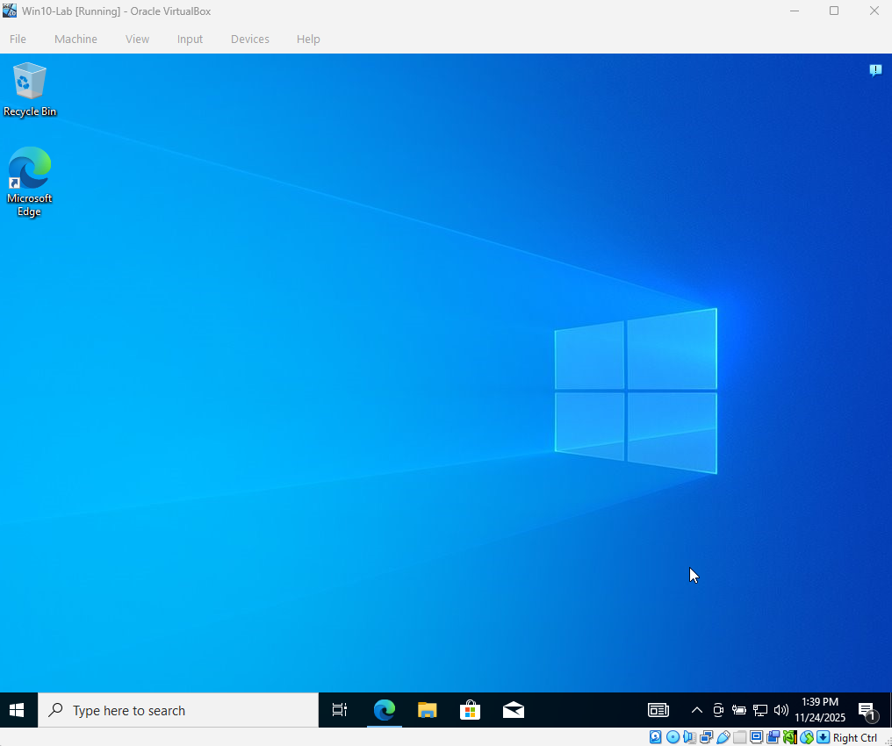

# IT-Portfolio
Hands-on IT/cybersecurity labs for portfolio and resume.

## Week 1: Windows 10 VM Setup on VirtualBox

**Objective**  
Set up a Windows 10 virtual machine on Oracle VirtualBox to serve as a client machine for hands-on IT labs, including Active Directory and ticketing simulations. This environment allows practicing core IT skills safely without affecting the host system.

**System Configuration (Host & VM)**

| Component       | Configuration |
|-----------------|---------------|
| Host OS         | Windows 11, 64-bit |
| Processor       | AMD Ryzen 7 8845HS (3.8 GHz, 8 cores) |
| RAM             | 16 GB (Allocated 4 GB for VM) |
| Disk            | 50 GB dynamically allocated |
| Virtualization  | Oracle VirtualBox 7.x |
| ISO             | Windows 10 64-bit Evaluation |

**Steps Completed**

1. **Installed VirtualBox**  
   Verified installation by opening the VirtualBox dashboard  
   

2. **Created New VM**  
   Name: Win10-Lab  
   Type: Microsoft Windows → Version: Windows 10 (64-bit)  
   RAM: 4096 MB  
   Virtual Hard Disk: 50 GB, VDI, dynamically allocated  
   

3. **Attached Windows 10 ISO**  
   Storage → Optical Drive → Selected ISO  

4. **Started VM and Began Installation**  
   Followed Windows setup prompts (language, region, keyboard, etc.)  
   Installed Windows Pro for lab compatibility  
   

**Observations**  
- VM boots successfully; installation runs without errors.  
- 4 GB RAM and 50 GB disk sufficient for lab exercises.  
- VirtualBox snapshots can be created to preserve clean baseline.  

**Next Steps**  
- Complete Windows installation and updates.  
- Take a snapshot of the clean install:   
- Begin Week 1 lab exercises:  
  - Active Directory client simulation  
  - Ticketing system setup

**Files / Screenshots Included**  
- `VirtualBox_Installed.png`  
- `Win10_VM_Config.png`  
- `Win10_ISO_Attached.png`  
- `Win10_Setup_Screen.png`  
- `Snapshot_CleanInstall.png`  

---

## Week 1: Kali Linux VM Setup on VirtualBox

**Objective**  
Set up a pre-installed Kali Linux virtual machine to practice penetration testing, network security, and cybersecurity labs safely in VirtualBox.

**System Configuration (Host & VM)**

| Component       | Configuration |
|-----------------|---------------|
| Host OS         | Windows 11, 64-bit |
| Processor       | AMD Ryzen 7 8845HS (3.8 GHz, 8 cores) |
| RAM             | 16 GB (Allocated 8 GB for VM) |
| Disk            | ~14 GB dynamically allocated |
| Virtualization  | Oracle VirtualBox 7.x |
| VM Image        | Kali Linux VirtualBox pre-installed VM, 64-bit |

**Steps Completed**

1. **Downloaded Kali Linux VirtualBox Image**  
   Chose the pre-installed VirtualBox image from Kali official site  
   

2. **Imported VM into VirtualBox**  
   Double-clicked OVA file → VirtualBox imported VM automatically  
   

3. **Configured VM Settings**  
   Increased RAM from 2 GB to 8 GB for smoother performance  

4. **Booted Kali Linux VM**  
   Default username/password: kali / kali  
   Verified successful login  
   

**Observations**  
- VM boots successfully without errors.  
- RAM increase improves responsiveness.  
- Ready for hands-on cybersecurity labs and testing tools.

**Next Steps**  
- Begin Kali Linux labs (network scanning, password testing, and security tool usage).

**Files / Screenshots Included**  
- `Kali_VM_Download.png`  
- `Kali_VM_Imported.png`  
- `Kali_Home_Screen.png`

- ---

### Week 1: Windows Server 2025 Setup on VirtualBox

**Objective**  
Set up a Windows Server 2025 (Standard Evaluation, Desktop Experience) VM to act as the Domain Controller for Active Directory and Group Policy labs.

**System Configuration (Host & VM)**

| Component       | Configuration |
|-----------------|---------------|
| Host OS         | Windows 11, 64-bit |
| Processor       | AMD Ryzen 7 8845HS (8 cores @ 3.8 GHz) |
| RAM             | 16 GB (Allocated 4–6 GB for VM) |
| Disk            | 60 GB dynamically allocated |
| Virtualization  | Oracle VirtualBox 7.x |
| ISO             | Windows Server 2025 Standard Evaluation (Desktop Experience) |

**Steps Completed**

1. **Created New Windows Server VM**  
   Name: `WinServer-DC`  
   Type: Microsoft Windows → *Windows 2022 (64-bit)*  
   RAM: 4096–6144 MB  
   Disk: 60 GB (VDI, dynamically allocated)  
   

2. **Attached Server 2025 ISO**  
   Storage → Optical Drive → Windows Server ISO  

3. **Installed Windows Server 2025**  
   Selected *Standard Evaluation (Desktop Experience)*  
   Reached Server Manager dashboard.
   

**Observations**  
- Server boots normally and Server Manager loads on login.  
- 4–6 GB RAM is enough for AD DS labs.  
- Desktop Experience is easier for GPO/AD administration.

**Snapshot**  

**Next Steps**  
- Promote server to Domain Controller  
- Install AD DS  
- Create users, OUs, and groups  
- Apply GPOs (USB disable, password policy, wallpaper)

